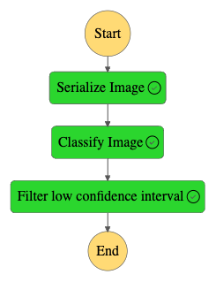
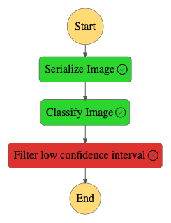

# Building a Machine Learning Workflow for Scones Unlimited with Amazon SageMaker

## Project Overview

In this project, I've used AWS SageMaker to build an image classification model that can distinguish bicycles from motorcycles. I've also deployed the model using AWS Lambda functions to create supporting services and AWS Step Functions to compose the model and services into an event-driven application.

## Project Steps Overview

- **Step 1:** Data Staging
- **Step 2:** Model Training and Deployment
- **Step 3:** Lambdas and Step Function Workflow
- **Step 4:** Testing and Evaluation
- **Step 5:** Cleanup Cloud Resources

## Building a State Machine via AWS Step Functions
* Step Function Graph (that met the inference threshold)

* Step Function Graph (that did not meet the inference threshold)
  !
